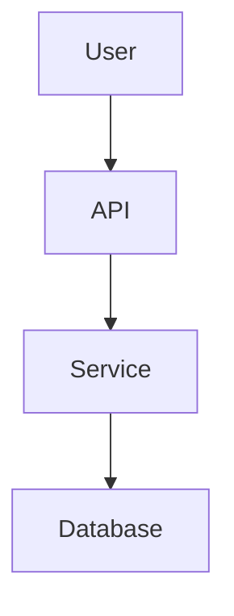
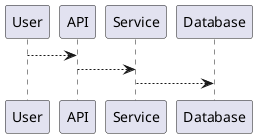

# 📝 08 — Documentação e Diagramas

## Por que documentar?

Uma arquitetura precisa ser compreendida por:

* desenvolvedores;
* arquitetos;
* analistas;
* DevOps;
* gestores;
* novos membros da equipe.

---

# Architecture Decision Records — ADR

ADR registra decisões arquiteturais.

Exemplo:

```text
# ADR-001 — Escolha do PostgreSQL

## Contexto

O sistema precisa armazenar dados relacionais.

## Decisão

Utilizar PostgreSQL.

## Alternativas

- MySQL
- MongoDB
- PostgreSQL

## Consequências

### Positivas

- SQL
- ACID
- Ecossistema maduro

### Negativas

- Escalabilidade horizontal mais complexa
```

---

# C4 Model

O C4 Model utiliza níveis de abstração:

```text
Context
   ↓
Container
   ↓
Component
   ↓
Code
```

---

## Context

Mostra:

* sistema;
* usuários;
* sistemas externos.

---

## Container

Mostra:

* aplicações;
* bancos;
* serviços.

---

## Component

Mostra os componentes internos.

---

## Code

Mostra detalhes da implementação.

---

# Diagramas

Podem ser utilizados:

* diagramas de contexto;
* componentes;
* sequência;
* implantação;
* infraestrutura.

---

# Mermaid

Exemplo:



---

# PlantUML

Exemplo:



---

# 📌 Objetivo

O objetivo do diagrama não é ser bonito.

> O objetivo é facilitar a compreensão da arquitetura.
